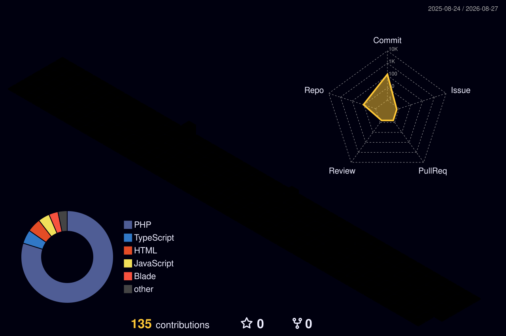
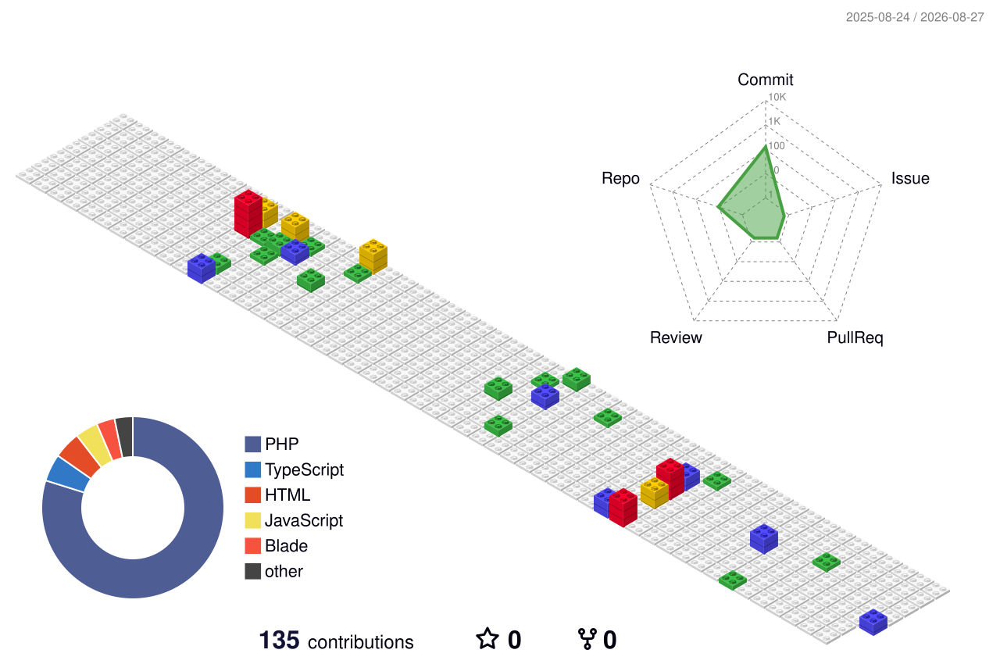
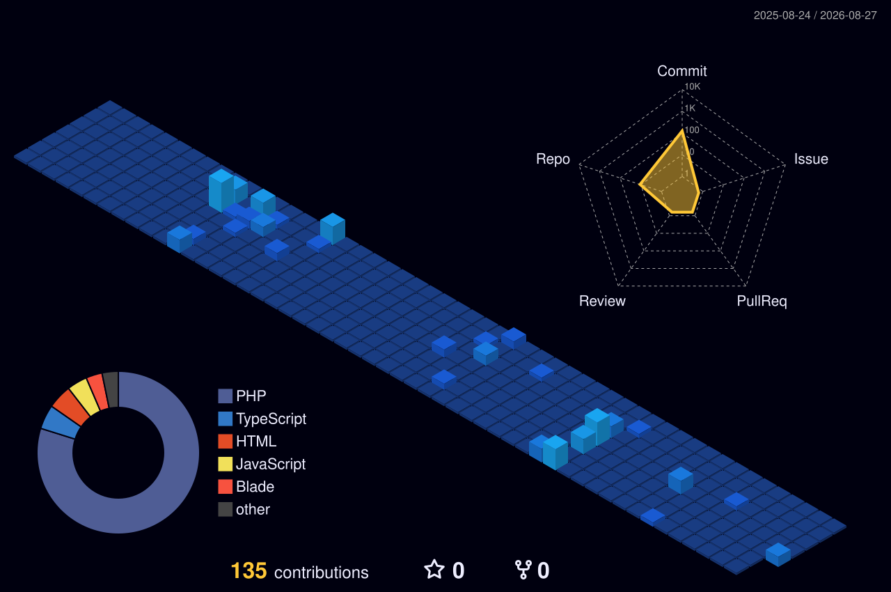
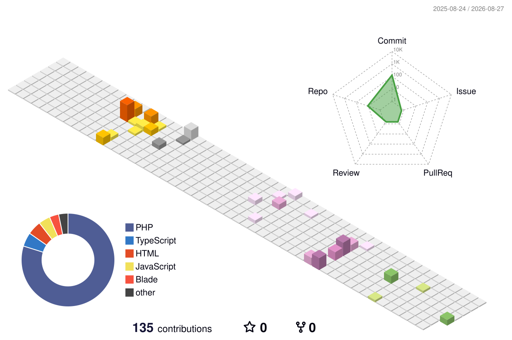
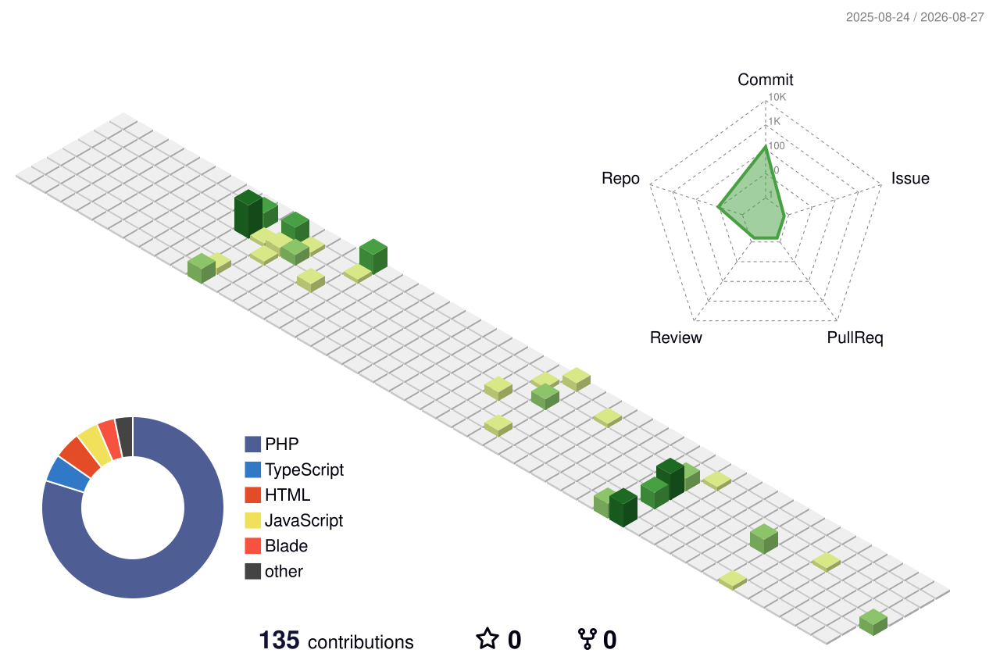

<!-- ══════════════════════════════════════════════════════════════ -->
<!--   S U B A S H   V   ·   GitHub Profile README                  -->
<!--                                                                -->
<!--   Every remote image below was reachability-checked.           -->
<!--   Panels under ./assets/ and ./profile-3d-contrib/ are         -->
<!--   generated INTO this repo by Actions — no third-party         -->
<!--   render server can take them down. See SETUP.md.              -->
<!--                                                                -->
<!--   Table cells use raw HTML on purpose: markdown inside <td>    -->
<!--   renders inconsistently on GitHub.                            -->
<!-- ══════════════════════════════════════════════════════════════ -->

<!-- ─────────────  HERO  ───────────── -->

<!-- ─────────────  TYPEWRITER  ───────────── -->

 

<!-- ─────────────  STATUS PILLS  ───────────── -->

  

<!-- ─────────────  SNAKE  (light + dark aware)  ───────────── -->

<picture>
  <source media="(prefers-color-scheme: dark)"  srcset="https://raw.githubusercontent.com/subashvs7/subashvs7/output/github-contribution-grid-snake-dark.svg" />
  <source media="(prefers-color-scheme: light)" srcset="https://raw.githubusercontent.com/subashvs7/subashvs7/output/github-contribution-grid-snake.svg" />
  
</picture>

 

<!-- ══════════════════════════════════════════════════════════════ -->
<!--                            ABOUT                               -->
<!-- ══════════════════════════════════════════════════════════════ -->

<table>
<tr>
<td width="56%" valign="top">

<h3>&nbsp;◆&nbsp; whoami</h3>

<pre><code>const subash = {
  role     : "Full-Stack Developer",
  stack    : ["React", "TypeScript", "Laravel", "MySQL"],
  building : ["ERP", "MES", "SaaS platforms"],
  obsession: "config-driven UIs — schema in, interface out",
  learning : ["Docker", "CI/CD", "deployment"],
  debugsAt : "2 AM, unreasonably well",
};</code></pre>

<ul>
<li>🏗️ &nbsp;Building <b>ERP &amp; SaaS</b> platforms on React + Laravel</li>
<li>🧩 &nbsp;Schema in, interface out — <b>config-driven UIs</b></li>
<li>🗄️ &nbsp;Comfortable from <b>MySQL schema</b> to <b>pixel polish</b></li>
<li>💬 &nbsp;Ask me about React, Laravel, REST design, query tuning</li>
</ul>

</td>
<td width="44%" valign="top">

</td>
</tr>
</table>

 

<!-- ══════════════════════════════════════════════════════════════ -->
<!--                         TECH STACK                             -->
<!-- ══════════════════════════════════════════════════════════════ -->

<h2>◆ &nbsp;T E C H &nbsp; S T A C K&nbsp; ◆</h2>

<table>
<tr>
<td align="center" width="33%">
<b>Frontend</b>  
 

</td>
<td align="center" width="33%">
<b>Backend &amp; Data</b>  
 

</td>
<td align="center" width="33%">
<b>Tooling</b>  
 

</td>
</tr>
</table>

 

<!-- ══════════════════════════════════════════════════════════════ -->
<!--                            METRICS                             -->
<!--   Generated by .github/workflows/metrics.yml into ./assets     -->
<!--   so they can never 404 or rate-limit.                         -->
<!-- ══════════════════════════════════════════════════════════════ -->

<h2>◆ &nbsp;M E T R I C S&nbsp; ◆</h2>

 

<table>
<tr>
<td width="50%" valign="top">

</td>
<td width="50%" valign="top">

</td>
</tr>
</table>

 

  

 

<!-- ══════════════════════════════════════════════════════════════ -->
<!--                   3D CONTRIBUTION SKYLINE                      -->
<!-- ══════════════════════════════════════════════════════════════ -->

<h2>◆ &nbsp;3 D &nbsp; C O N T R I B U T I O N &nbsp; A N A L Y S I S&nbsp; ◆</h2>

<i>Every commit I've pushed, rendered as isometric geometry. 
Rebuilt nightly by GitHub Actions and committed straight into this repo.</i>

  

<!-- ── Primary skyline ── -->

  

<b>◇ &nbsp;H O W &nbsp; T O &nbsp; R E A D &nbsp; I T&nbsp; ◇</b>

  

<table>
<tr>
<td align="center" width="25%"><b>Column</b> one calendar week</td>
<td align="center" width="25%"><b>Depth</b> day of that week</td>
<td align="center" width="25%"><b>Height</b> commits that day</td>
<td align="center" width="25%"><b>Hue</b> relative intensity</td>
</tr>
</table>

 

<!-- ── Alternate renders ── -->

<b>◇ &nbsp;F O U R &nbsp; P R O J E C T I O N S&nbsp; ◇</b>

  

<table>
<tr>
<td align="center" width="50%">
<b>GIT BLOCK</b> 
Voxel stacks — reads raw commit volume per day  

</td>
<td align="center" width="50%">
<b>NIGHT VIEW</b> 
High contrast — isolates streaks against dead weeks  

</td>
</tr>
<tr>
<td align="center" width="50%">
<b>SEASONS</b> 
Animated — palette shifts across the four quarters  

</td>
<td align="center" width="50%">
<b>GROWTH</b> 
Animated — the year building up commit by commit  

</td>
</tr>
</table>

 

<!-- ── Isometric calendar ── -->

<b>◇ &nbsp;I S O M E T R I C &nbsp; C A L E N D A R&nbsp; ◇</b>

 

The same year flattened to an isometric grid — easier to spot rhythm than magnitude

  

 

<!-- ══════════════════════════════════════════════════════════════ -->
<!--                          PROJECTS                              -->
<!--   Hand-built cards: the github-readme-stats /api/pin service    -->
<!--   is down (503), so live data comes from shields.io instead.    -->
<!-- ══════════════════════════════════════════════════════════════ -->

<h2>◆ &nbsp;S E L E C T E D &nbsp; W O R K&nbsp; ◆</h2>

<table>
<tr>
<td width="50%" valign="top">
<h3>📋 &nbsp;<a href="https://github.com/subashvs7/task-management">Task Management</a></h3>

Board-based task tracker — assignments, status transitions and filtering, written in TypeScript for end-to-end type safety.

<code>TypeScript</code> &nbsp;<code>React</code>

</td>
<td width="50%" valign="top">
<h3>💰 &nbsp;<a href="https://github.com/subashvs7/budgetapp">Budget App</a></h3>

Personal finance tracker on Laravel — category budgets, transaction history and monthly rollups backed by MySQL.

<code>Laravel</code> &nbsp;<code>Blade</code> &nbsp;<code>MySQL</code>

</td>
</tr>
<tr>
<td width="50%" valign="top">
<h3>📊 &nbsp;<a href="https://github.com/subashvs7/laravel-dashboard">Laravel Dashboard</a></h3>

Admin panel with charts, sortable data tables and role-based access control — the foundation I reuse across projects.

<code>Laravel</code> &nbsp;<code>Blade</code> &nbsp;<code>Charts</code>

</td>
<td width="50%" valign="top">
<h3>🔴 &nbsp;<a href="https://github.com/subashvs7/react-reddit">React Reddit</a></h3>

Reddit client consuming the public API — live subreddit feeds, search and client-side filtering with hooks.

<code>React</code> &nbsp;<code>JavaScript</code> &nbsp;<code>REST</code>

</td>
</tr>
<tr>
<td width="50%" valign="top">
<h3>🏢 &nbsp;<a href="https://github.com/subashvs7/CRM-ZAZU">CRM ZAZU</a></h3>

Customer relationship manager — lead pipeline, contact history and follow-up scheduling on a Laravel backend.

<code>PHP</code> &nbsp;<code>Laravel</code> &nbsp;<code>MySQL</code>

</td>
<td width="50%" valign="top">
<h3>🌶️ &nbsp;<a href="https://github.com/subashvs7/spicemart">Spicemart</a></h3>

E-commerce storefront — catalogue, cart and checkout flow, with an admin side for inventory and orders.

<code>PHP</code> &nbsp;<code>Laravel</code> &nbsp;<code>Blade</code>

</td>
</tr>
</table>

 

<!-- ══════════════════════════════════════════════════════════════ -->
<!--                           CONNECT                              -->
<!-- ══════════════════════════════════════════════════════════════ -->

<h2>◆ &nbsp;L E T ' S &nbsp; T A L K&nbsp; ◆</h2>

&nbsp;

&nbsp;

&nbsp;

  

<i>"Make it work. Make it right. Make it fast."</i>

