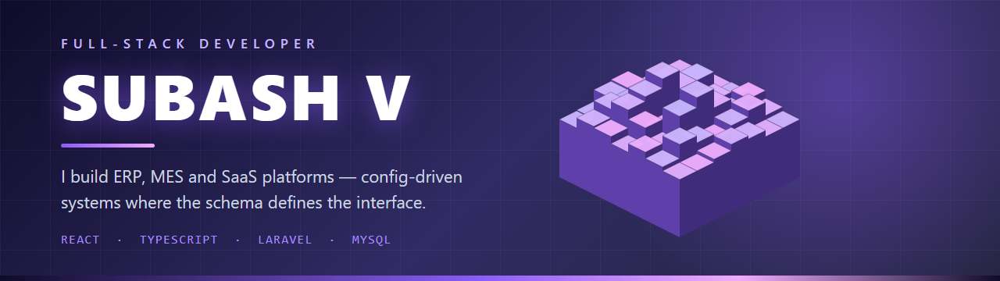

<!-- ══════════════════════════════════════════════════════════════ -->
<!--   S U B A S H   V   ·   GitHub Profile README                  -->
<!--                                                                -->
<!--   Structure is projects-first by design. Contribution visuals   -->
<!--   (snake / 3D skyline / streak / isocalendar / habits) were     -->
<!--   removed: the public account has ~2 public events, so they     -->
<!--   rendered as empty grids and undersold the actual work.        -->
<!--                                                                -->
<!--   assets/hero.png is generated locally by                       -->
<!--   scripts/gen-social-previews.mjs -- it replaces capsule-render -->
<!--   "venom", which drew a small blob and let the title overflow.  -->
<!--                                                                -->
<!--   Table cells use raw HTML on purpose: markdown inside <td>     -->
<!--   renders inconsistently on GitHub.                             -->
<!-- ══════════════════════════════════════════════════════════════ -->

  

&nbsp;

&nbsp;

&nbsp;

 

<!-- ══════════════════════════════════════════════════════════════ -->
<!--                          POSITIONING                           -->
<!-- ══════════════════════════════════════════════════════════════ -->

<table>
<tr>
<td width="58%" valign="top">

<h3>&nbsp;◆&nbsp; What I do</h3>

I build <b>internal business platforms</b> — approval systems, transport and
cargo operations, project and task management. The kind of software where the
hard part isn't the UI, it's modelling an organisation's rules without
hard-coding them.

My work is <b>config-driven</b>: approval chains, org hierarchies and permission
matrices live in the database as rows, not in the codebase as
<code>if</code> statements. Adding a new workflow is a configuration change,
not a deployment.

<ul>
<li>🏗️ &nbsp;<b>Laravel</b> APIs and <b>React / TypeScript</b> front-ends</li>
<li>🧩 &nbsp;Reusable CRUD engines over hand-written screens</li>
<li>🗄️ &nbsp;From <b>MySQL schema design</b> to pixel polish</li>
<li>🚀 &nbsp;Ships to plain shared hosting — no Docker or queues required</li>
</ul>

</td>
<td width="42%" valign="top">

</td>
</tr>
</table>

 

<!-- ══════════════════════════════════════════════════════════════ -->
<!--                        FEATURED WORK                           -->
<!-- ══════════════════════════════════════════════════════════════ -->

<h2>◆ &nbsp;F E A T U R E D &nbsp; W O R K&nbsp; ◆</h2>

 

<!-- ─────────────  FLAGSHIP  ───────────── -->

<table>
<tr>
<td valign="top">

<h3>🏛️ &nbsp;<a href="https://github.com/subashvs7/approval_project">Enterprise Approval Management System</a> &nbsp;</h3>

A fully database-driven approval platform. Approval categories, types,
workflows and ordered approver steps are all configured at runtime — the engine
reads them, so a new approval chain needs no code change.

<b>Request lifecycle:</b> submit · approve · reject · return · forward ·
delegate · cancel · clone, each writing to an auditable timeline. 
<b>Also ships:</b> RBAC with a permission matrix, org hierarchy
(company → branch → department → designation → employee), multi-upload
attachments on private storage with streamed download, role-based dashboards
with dependency-free charts, DB-templated in-app and email notifications, and
reports with group-by dimensions plus CSV/PDF export.

<code>Laravel 12</code> <code>PHP 8.3</code> <code>MySQL 8</code>
<code>Sanctum</code> <code>React 19</code> <code>Vite</code>
<code>React Router</code> <code>Bootstrap 5</code>

</td>
</tr>
</table>

 

<!-- ─────────────  PUBLIC + PRIVATE GRID  ───────────── -->

<table>
<tr>
<td width="50%" valign="top">
<h3>🗂️ &nbsp;<a href="https://github.com/subashvs7/task-management">Task Management</a></h3>

Real-time Kanban. Drag-and-drop boards built on <code>@dnd-kit</code>, global
state in Redux Toolkit, and live multi-user updates pushed over WebSockets via
Laravel Echo and Pusher.

<code>TypeScript</code> <code>React</code> <code>Redux Toolkit</code> <code>Tailwind</code> <code>Laravel</code>

</td>
<td width="50%" valign="top">
<h3>📦 &nbsp;Meenachi Express Cargo &nbsp;</h3>
<!-- TODO(subash): confirm this summary and the stack before publishing. -->

Cargo booking and consignment platform — shipment entry, tracking through
delivery, and branch-level operational reporting.

<i>Private · client work — walkthrough available on request.</i>

</td>
</tr>
<tr>
<td width="50%" valign="top">
<h3>🚚 &nbsp;PSS Transport &nbsp;</h3>
<!-- TODO(subash): confirm this summary and the stack before publishing. -->

Transport operations system — trip and fleet records, consignment handling and
the billing trail that follows them.

<i>Private · client work — walkthrough available on request.</i>

</td>
<td width="50%" valign="top">
<h3>📊 &nbsp;Proman &nbsp;</h3>
<!-- TODO(subash): confirm this summary and the stack before publishing. -->

Project management platform — projects, milestones and team assignment with
progress tracking across delivery stages.

<i>Private · client work — walkthrough available on request.</i>

</td>
</tr>
<tr>
<td width="50%" valign="top">
<h3>🧭 &nbsp;SAS &nbsp;</h3>
<!-- TODO(subash): I could not read this repo. Replace this line entirely. -->

Business operations platform built on the same config-driven foundation.

<i>Private · client work — walkthrough available on request.</i>

</td>
<td width="50%" valign="top">
<h3>🧰 &nbsp;<a href="https://github.com/subashvs7?tab=repositories">More work</a></h3>

Laravel admin dashboards, a CRM, e-commerce builds and API clients — the
smaller repos where individual patterns were worked out before landing in the
platforms above.

</td>
</tr>
</table>

 

<!-- ══════════════════════════════════════════════════════════════ -->
<!--                          HOW I BUILD                           -->
<!--   Concrete patterns, taken from the approval_project codebase.  -->
<!-- ══════════════════════════════════════════════════════════════ -->

<h2>◆ &nbsp;H O W &nbsp; I &nbsp; B U I L D&nbsp; ◆</h2>
<i>Decisions I make once, then reuse across every module.</i>

 

<table>
<tr>
<td width="50%" valign="top">
<h4>◇ &nbsp;One data standard, every table</h4>

Every business table carries <code>status</code>, <code>is_deleted</code>,
<code>created_by</code>, <code>updated_by</code> and timestamps. Nothing is
ever physically deleted — a global scope filters soft-deleted rows out of every
query automatically, so no feature can forget to.

</td>
<td width="50%" valign="top">
<h4>◇ &nbsp;One API envelope</h4>

Every endpoint answers with the same shape —
<code>{ success, message, data, meta }</code> — and errors carry proper status
codes (401 / 403 / 404 / 422 / 429 / 500). The front-end has exactly one
response contract to handle.

</td>
</tr>
<tr>
<td width="50%" valign="top">
<h4>◇ &nbsp;Config over code</h4>

Approval chains, roles and org hierarchies are rows in the database, not
branches in the source. New workflows are configured by an admin at runtime
rather than shipped in a release.

</td>
<td width="50%" valign="top">
<h4>◇ &nbsp;Deployable anywhere</h4>

Targets plain Apache shared hosting — no Docker, Redis, queues or websocket
servers required to run the core product. Constraints picked deliberately, so
clients can host it themselves.

</td>
</tr>
</table>

 

<!-- ══════════════════════════════════════════════════════════════ -->
<!--                          TECH STACK                            -->
<!-- ══════════════════════════════════════════════════════════════ -->

<h2>◆ &nbsp;T E C H &nbsp; S T A C K&nbsp; ◆</h2>

<table>
<tr>
<td align="center" width="33%">
<b>Frontend</b>  
 

</td>
<td align="center" width="33%">
<b>Backend &amp; Data</b>  
 

</td>
<td align="center" width="33%">
<b>Tooling</b>  
 

</td>
</tr>
</table>

 

<!-- No auto-generated "most used languages" panel here on purpose.        -->
<!-- It reads only PUBLIC repos, and the platforms above are private, so   -->
<!-- it reported "PowerShell 100%" (from a helper script in this repo) --  -->
<!-- actively wrong. The curated icons above are accurate; keep it manual. -->

 

<!-- ══════════════════════════════════════════════════════════════ -->
<!--                           CONTACT                              -->
<!-- ══════════════════════════════════════════════════════════════ -->

<h2>◆ &nbsp;L E T ' S &nbsp; T A L K&nbsp; ◆</h2>

<i>Open to full-stack roles and freelance platform work.</i>

&nbsp;

&nbsp;

  

<i>"Make it work. Make it right. Make it fast."</i>

